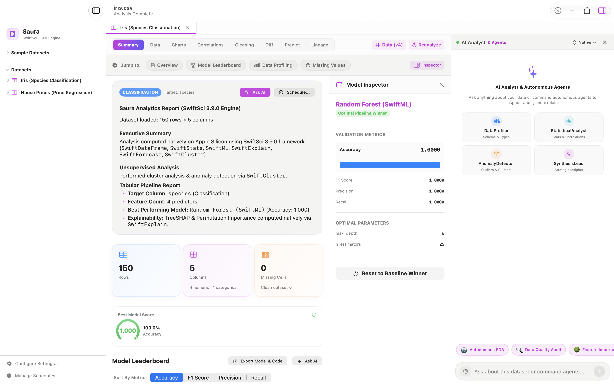
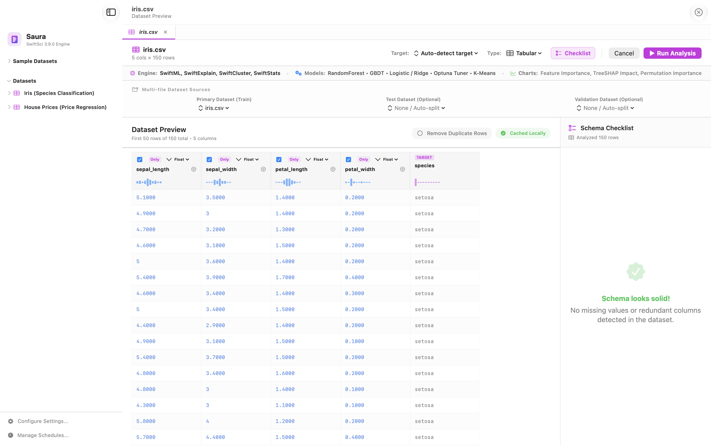
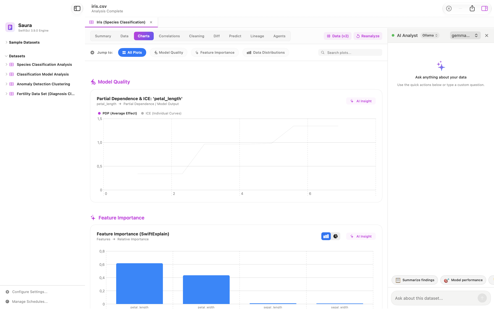
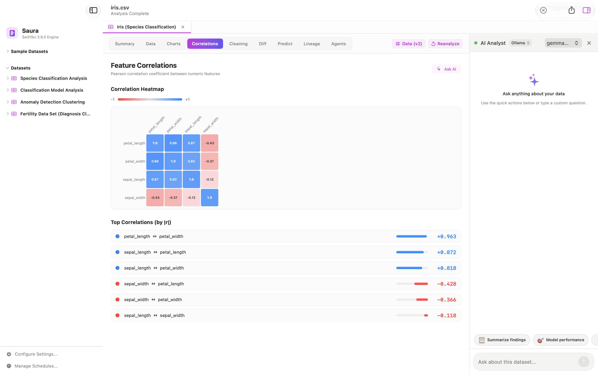
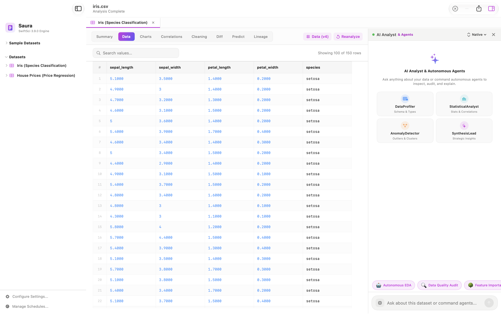

# Saura 🌌
### Native Apple Silicon Data Science & AI Workbench for macOS

  

  
  
  
  
  
  

---

## ⚡️ Overview

**Saura** is an in-process, hardware-accelerated Data Science, AutoML, and AI Analytics desktop workbench built from the ground up for macOS and Apple Silicon. 

Unlike traditional data science workflows reliant on heavy Python runtimes, Conda environments, and external server daemons, Saura operates as a **100% native macOS binary**. Powered by **Swift 6** and **SwiftSci 3.9.0**, it leverages Apple Silicon's unified memory architecture, Accelerate vDSP vector instructions, and MLX GPU acceleration for sub-millisecond computations with a near-zero memory footprint.

---

## 📥 Download & Installation

### Option 1: Direct DMG Download (Recommended)
1. Download the latest release: **[Saura-3.9.0-arm64.dmg](https://github.com/Nodibell/Saura-App/releases/latest/download/Saura-3.9.0-arm64.dmg)**
2. Open the `.dmg` file.
3. Drag **Saura.app** into your `/Applications` folder.
4. Launch Saura from Launchpad or Spotlight.

> [!NOTE]  
> If prompted by macOS Gatekeeper on first launch, right-click (or Control-click) `Saura.app` in Finder and select **Open**.

### Option 2: Build from Source
Source code is maintained in the dedicated code repository: [Nodibell/Saura](https://github.com/Nodibell/Saura).

---

## 🚀 Key Features

### 📊 1. Universal Zero-Copy Ingestion
- **Tabular & Columnar**: Streaming CSV/TSV, JSON, and Apache Parquet (Snappy decompression & dictionary unpacking).
- **Relational Databases**: Direct native SQLite database ingestion with automatic table and schema discovery.
- **Tensors & Images**: Native zero-dependency NPY/NPZ multi-array archives parser with image dimension inference.
- **Hub Streams**: Ingest datasets on-the-fly directly from Hugging Face Hub and Kaggle datasets.

### 📈 2. Time Series Forecasting & Anomaly Sentry
- **Algorithms**: Accelerated Holt-Winters Exponential Smoothing, ARIMA, SARIMA, and Kalman Filtering.
- **Dynamic Ribbons**: 95% distribution-free forecast prediction bands.
- **S-ESD Anomaly Alerts**: Seasonal Extreme Studentized Deviate detection with Median Absolute Deviation (MAD) scaling, flagging temporal outliers directly on interactive timeline charts.

### 🤖 3. Native Machine Learning & AutoML
- **Models**: Gradient Boosted Decision Trees (GBDT), Random Forest, Logistic & Linear Regression, Multi-Layer Perceptron (MLP).
- **Quantile Loss**: Distribution-free asymmetric prediction bounds ($p_{10}, p_{90}$) built directly into tree ensembles.
- **AutoML**: Automated cross-validation with K-Fold and Stratified K-Fold hyperparameter grid search.
- **One-Click Export**: Export trained ensembles directly to Apple Core ML (`.mlpackage`) or ONNX formats.

### 🔍 4. Explainable AI (XAI) & Manifold Projections
- **SHAP**: In-process TreeSHAP and parallelized KernelSHAP with interactive Beeswarm plots.
- **PDP**: Partial Dependence Plots for multi-feature non-linear interaction discovery.
- **t-SNE Projections**: 2D non-linear manifold dimensionality reduction to cluster high-dimensional feature spaces.

### 🛡️ 5. Rigorous Data Quality & Drift Guardrails
- **Data Drift**: Real-time 1D Earth Mover's Distance (Wasserstein) and Population Stability Index (PSI) to detect train-test covariate shift.
- **Target Leakage Sentry**: Automated identification of proxy features ($|r| \ge 0.999$, Rank $|\rho| \ge 0.999$), duplicate target vectors, and sequential ID leakage.
- **NLP Text Profiler**: 20 document-level lexical metrics (Shannon entropy, Type-Token Ratio TTR, Hapax Legomena, stopword pruning).

### 🧠 6. Local Autonomous AI Analyst
- Built-in ReAct agentic reasoning loop (`SwiftNativeAnalyst`).
- Direct integration with local Apple Silicon LLM runtimes (LM Studio, Ollama, MLX) for instant natural language querying, automated hypotheses generation, and interactive data insights.

---

## 📸 Interface Preview

  
   
  <em>AutoML Model Leaderboard, Model Inspector, Real-time Validation Metrics & Ollama AI Analyst</em>

 

| 📊 Data Ingestion & Pre-flight Schema | 📈 Model Quality & Partial Dependence (ICE) |
| :---: | :---: |
|  |  |
| *Streaming dataset preview, schema verification & column stats* | *PDP & ICE curves, SwiftExplain feature importance* |

| 🔥 Pearson Feature Correlation Matrix | 📑 High-Performance Data Inspector |
| :---: | :---: |
|  |  |
| *Interactive correlation heatmap & top ranked feature pairs* | *Virtual scrolling table supporting massive datasets* |

---

## 💻 System Requirements

- **Operating System**: macOS 14.0 (Sonoma) or macOS 15.0+ (Sequoia)
- **Architecture**: Apple Silicon (M1 / M2 / M3 / M4 family, Pro, Max, Ultra)
- **Memory**: 8 GB unified memory minimum (16 GB+ recommended for heavy 100k+ row datasets or local LLM execution)

---

## 🎓 Academic & Research Context

Saura was designed and engineered as part of research within the **Department of Automation and Intelligent Information Technologies (AIIT)** at **Vinnytsia National Technical University (VNTU)**:

- **Specialty**: 126 «Information Systems and Technologies»
- **Author**: Oleksii Chumak
- **Core Engine**: [SwiftSci](https://github.com/Nodibell/SwiftSci) (v3.9.0)

---

## 📜 License

Distributed under the **MIT License**. See `LICENSE` for details.
