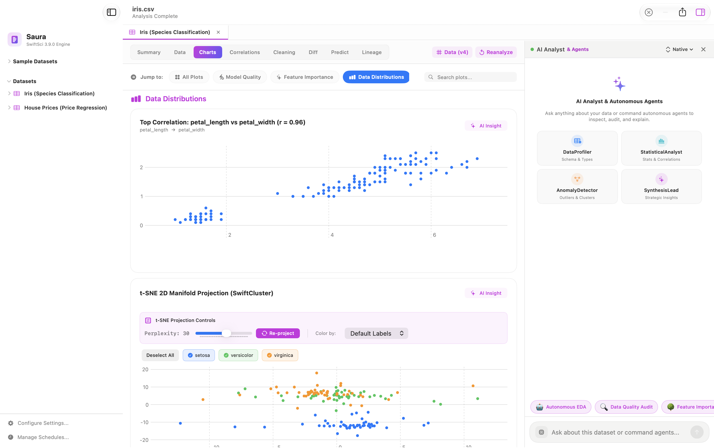
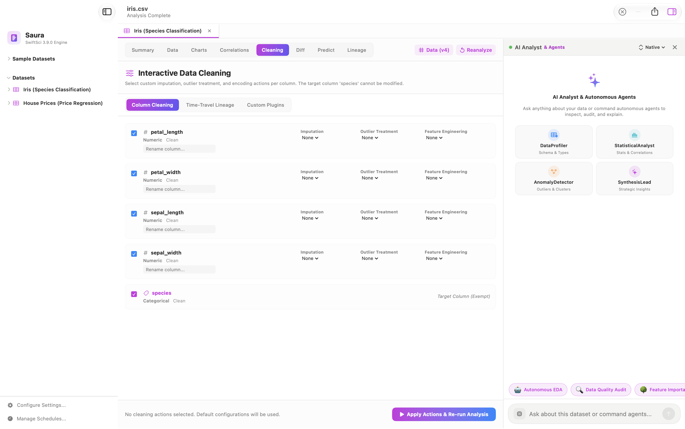
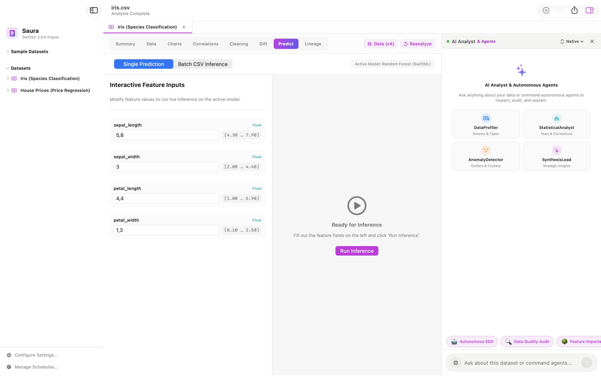
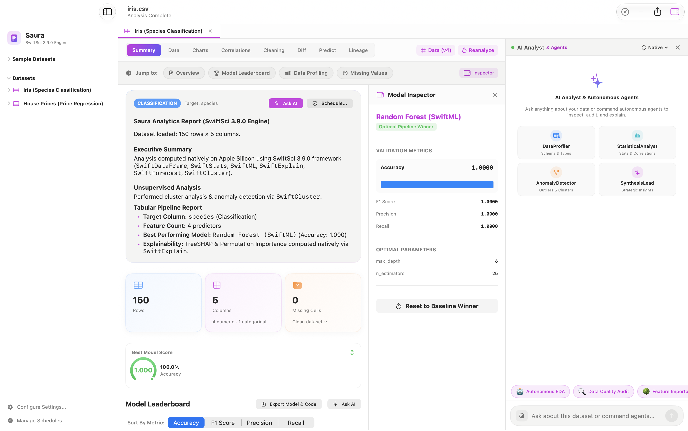

# Saura 🌌 — Interactive Application Walkthrough & User Guide

Welcome to the comprehensive walkthrough of **Saura**, the native Apple Silicon Data Science & AI Workbench for macOS.

This guide takes you through the entire end-to-end analytical workflow: from zero-copy data ingestion to automated machine learning (AutoML), explainable AI (XAI), correlation discovery, and autonomous LLM-powered data exploration.

---

## 📑 Table of Contents
1. [Prerequisites & Installation](#-prerequisites--installation)
2. [Step 1: Data Ingestion & Pre-flight Schema Inspection](#-step-1-data-ingestion--pre-flight-schema-inspection)
3. [Step 2: Running Native AutoML & The Summary Dashboard](#-step-2-running-native-automl--the-summary-dashboard)
4. [Step 3: Model Inspector & Diagnostics](#-step-3-model-inspector--diagnostics)
5. [Step 4: Model Quality & Explainability (XAI)](#-step-4-model-quality--explainability-xai)
6. [Step 5: Pearson Feature Correlations](#-step-5-pearson-feature-correlations)
7. [Step 6: High-Performance Data Table Inspector](#-step-6-high-performance-data-table-inspector)
8. [Step 7: Local AI Analyst (Ollama / LM Studio)](#-step-7-local-ai-analyst-ollama--lm-studio)
9. [Step 8: Model Export (Core ML & ONNX)](#-step-8-model-export-core-ml--onnx)

---

## 💻 Prerequisites & Installation

- **macOS**: 14.0 (Sonoma) or 15.0+ (Sequoia).
- **Chipset**: Apple Silicon (M1, M2, M3, M4 — Base, Pro, Max, Ultra).
- **RAM**: 8 GB minimum (16 GB+ recommended for local LLM inference).

### Quick Install
1. Download **[Saura-1.0.0-arm64.dmg](https://github.com/Nodibell/Saura-App/releases/download/v1.0.0/Saura-1.0.0-arm64.dmg)** from [GitHub Releases](https://github.com/Nodibell/Saura-App/releases).
2. Double-click the DMG and drag **Saura.app** into `/Applications`.
3. Launch Saura from Spotlight or Finder.

---

## 📥 Step 1: Data Ingestion & Pre-flight Schema Inspection

When you launch Saura, you are greeted with the streamlined ingest window. You can drag and drop any dataset or select one from the built-in **Sample Datasets** list (`iris.csv`, `house_prices.csv`, `airline_passengers.csv`, `breast_cancer.csv`).

  

### Key Capabilities in this view:
- **Instant Vector Ingestion**: Streaming ingestion with micro-sparkline distribution histograms for every numeric feature.
- **Modality Auto-Detection**: Automatically identifies whether your dataset is **Tabular Classification**, **Tabular Regression**, or **Time Series**.
- **Pre-flight Schema Checklist**:
  - Scans for **Constant Columns** with zero variance and provides an instant one-click *Exclude* action.
  - Flags missing values, infinite values, and suspected ID columns.
  - Automatically identifies and marks the optimal Target variable.
- Click **▶ Run Analysis** in the top right to start the in-process native computation engine.

---

## ⚡️ Step 2: Running Native AutoML & The Summary Dashboard

Once analysis is triggered, the **SwiftSci 3.9.0 Engine** compiles and executes native machine learning algorithms directly on Apple Silicon unified memory without launching external Python or conda processes.

  

### What you see on the Summary Dashboard:
1. **Executive Summary**: A generated breakdown detailing dataset dimensionality, unsupervised clustering outputs, best performing model, and explainability status.
2. **Key Metric Tiles**:
   - **Rows & Columns**: Quick cardinality breakdown (e.g. *150 Rows*, *5 Columns: 4 numeric, 1 categorical*).
   - **Missing Cells**: Immediate data cleanliness status (*Clean dataset ✓*).
   - **Best Model Score**: Gauge chart displaying overall performance (e.g. *100.0% Accuracy* or *R² = 0.892*).
3. **Model Leaderboard**:
   - Real-time comparison across algorithms: **Random Forest (SwiftML)**, **Gradient Boosted Decision Trees (GBDT)**, **Logistic / Ridge Regression**, and **MLP Neural Networks**.
   - Interactive metric sorting: switch between **Accuracy**, **F1 Score**, **Precision**, and **Recall**.

---

## 🔍 Step 3: Model Inspector & Diagnostics

Clicking on any candidate model in the Leaderboard opens the interactive **Model Inspector** drawer on the right side:
- **Optimal Hyperparameters**: View tuned depth, estimators, and learning rates (e.g. `max_depth = 6`, `n_estimators = 25`).
- **Comprehensive Validation Breakdown**: Full validation scores across folds.
- **Baseline Comparison**: One-click *Reset to Baseline Winner* to benchmark complex ensembles against simple linear heuristics.

---

## 📈 Step 4: Model Quality & Explainability (XAI)

Navigate to the **Charts** tab to audit model decisions and understand non-linear feature interactions.

  

### Built-in Interpretability Tools:
- **Partial Dependence Plots (PDP) & ICE**:
  - Displays both average effect (PDP) and individual conditional curves (ICE) to highlight feature non-linearities and threshold inflection points.
- **Feature Importance (SwiftExplain)**:
  - Bar charts and Beeswarm plots displaying relative feature weights and TreeSHAP attribution values.
  - Interactive sorting by feature contribution magnitude.
- **t-SNE 2D Manifold Projection & Smart Drill-Down (SwiftCluster)**:
  

    
  

  - **Nonlinear Dimensionality Reduction**: Unsupervised 2D projection embedding high-dimensional feature spaces ($N \ge 3$ features) while preserving local topological neighborhoods.
  - **Interactive Perplexity Slider**: Fine-tune cluster compactness on-the-fly (5 to 50) with instant native re-projection via `SwiftCluster`.
  - **Adaptive Target Coloring**: Classification datasets color points by discrete classes; continuous regression targets are automatically partitioned into 4 quartile intervals ($Q_1 \dots Q_4$) for clean, readable legends.
  - **Pinned Series Legend**: Toggling series filters on/off preserves each category's assigned palette color without cycling or recoloring.
  - **Precision Sample Drill-Down**: Selecting any data point reveals a dedicated `🔍 Drill Down: Row #X (class) >` action pill. Clicking it opens the full feature inspector positioned directly on that exact dataset row along with its cluster peers.

---

## 🧮 Step 5: Pearson Feature Correlations

Click on the **Correlations** tab to inspect collinearity and dependencies across numeric attributes.

  

- **Interactive Heatmap**: Visual color gradient from $-1.0$ (strong negative correlation, red) through $0.0$ to $+1.0$ (strong positive correlation, blue).
- **Top Correlations (by $|r|$)**:
  - Automatically ranks feature pairs by correlation strength (e.g. `petal_length ↔ petal_width` at $+0.963$).
  - Warns against multicollinearity which can destabilize regression coefficients and feature importances.

---

## 📑 Step 6: High-Performance Data Table Inspector

Switch to the **Data** tab to inspect the raw records underlying the analytical pipeline.

  

- **60 FPS Virtualized Scrolling**: Fluidly renders datasets with tens of thousands of rows using SwiftUI lazy evaluation.
- **Search & Filter**: Instant client-side substring matching on all columns without re-indexing.
- **Row Index & Type Badges**: Color-coded indicators distinguishing continuous floating-point variables from discrete categorical targets.
- **Modal Drill-Down Inspection**: Seamlessly opens filtered row previews triggered from charts, histograms, or t-SNE manifold projections.

---

## 🧹 Step 7: Interactive Data Cleaning & Time-Travel Lineage

Navigate to the **Cleaning** tab to resolve anomalies, perform missing value imputation, and track dataset provenance.

  

- **Per-Column Transformations**: Apply specialized missing-value imputations (Mean, Median, Constant, Forward-Fill), outlier pruning, and feature encoding.
- **Audit Lineage**: Reversible time-travel versioning (`Data v1`, `Data v2`, `Data v3`) tracking every modification step for reproducible ML governance.
- **One-Click Re-analysis**: Immediately trigger a clean pipeline execution with the updated schema.

---

## 🔮 Step 8: What-If Predictions & Scenario Simulation

Switch to the **Predict** tab to test hypothetical scenarios and evaluate model predictions in real time.

  

- **Interactive Feature Inputs**: Bound sliders and numeric inputs constrained to observed dataset minimum and maximum values.
- **Instant In-Process Inference**: Zero-latency predictions computed natively by the winning pipeline model (`Random Forest (SwiftML)`).
- **Batch CSV Inference**: Process bulk unlabelled datasets with instantaneous exported predictions.

---

## 🤖 Step 9: Local AI Analyst & Autonomous Copilot (Ollama / LM Studio)

On the right side of the window, the **AI Analyst** panel operates an autonomous **ReAct multi-agent reasoning loop**:

  

1. **Specialized Multi-Agent Roles**: Direct collaboration between `DataProfiler`, `StatisticalAnalyst`, `AnomalyDetector`, and `SynthesisLead`.
2. **Model Selection**: Switch seamlessly between local runtimes (**Ollama**, **LM Studio**, or **MLX Local**).
3. **Zero Cloud Egress**: Sensitive enterprise datasets never leave your Mac — prompts and vector contexts are generated and processed 100% locally on Apple Silicon Neural Engine/GPU.
4. **One-Click Quick Actions**:
   - `📋 Summarize findings`: Generates an executive narrative of key statistical anomalies.
   - `🎯 Model performance`: Synthesizes model trade-offs and recommends deployment candidates.
5. **Natural Language Queries**: Ask custom questions in plain language (e.g., *"Which features have the highest collinearity and might cause leakage?"* or *"Explain why petal_length was chosen as the primary decision split"*).

---

## 🚀 Step 10: Model Export (Core ML & ONNX)

Once satisfied with a winning model from the AutoML pipeline:
1. Click **Export Model & Code** on the Summary tab.
2. Choose your target deployment format:
   - **Apple Core ML (`.mlpackage`)**: For zero-latency inference inside iOS, iPadOS, and macOS apps.
   - **ONNX Format**: For cross-platform deployment on Linux servers, containers, or edge devices.
   - **Swift Source Code**: Generates self-contained, dependency-free Swift prediction routines.

---

## 🎓 Summary & Presentation Checklist (МКР)

| Feature Area | Implementation in Saura | Technology Used |
| :--- | :--- | :--- |
| **Ingestion** | Zero-copy CSV, TSV, JSON, Parquet, SQLite, NPY/NPZ | `vDSP`, Swift 6 Streaming Readers |
| **Engine** | In-process native execution | `SwiftSci 3.9.0` (Native Swift Framework) |
| **AutoML** | Hyperparameter grid search & K-Fold CV | SwiftML, Decision Forests, GBDT |
| **Explainability** | TreeSHAP, KernelSHAP, PDP / ICE | SwiftExplain Native Attribution |
| **Manifold Projection** | t-SNE 2D with Perplexity tuning & Row Drill-Down | SwiftCluster, Barnes-Hut / Exact t-SNE |
| **Forecasting** | Holt-Winters, ARIMA, S-ESD Anomaly Ribbons | SwiftForecast, Apple Accelerate vDSP |
| **Security & Privacy** | 100% On-Device, No cloud upload | Local LLM via Ollama / LM Studio API |
| **Distribution** | Standalone `.dmg` Apple Silicon package | `hdiutil`, notarization-ready arm64 binary |
